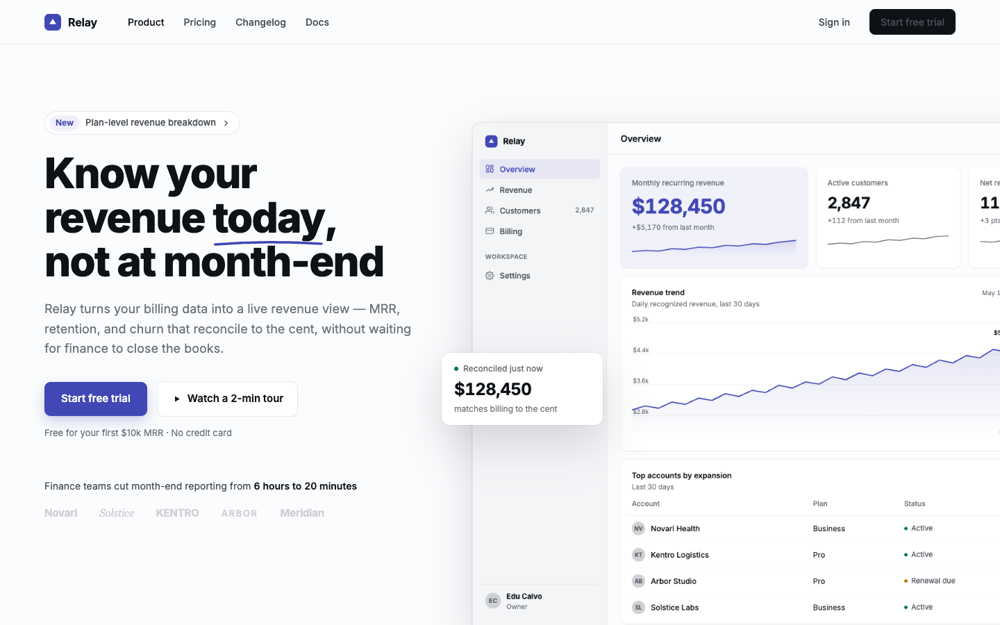
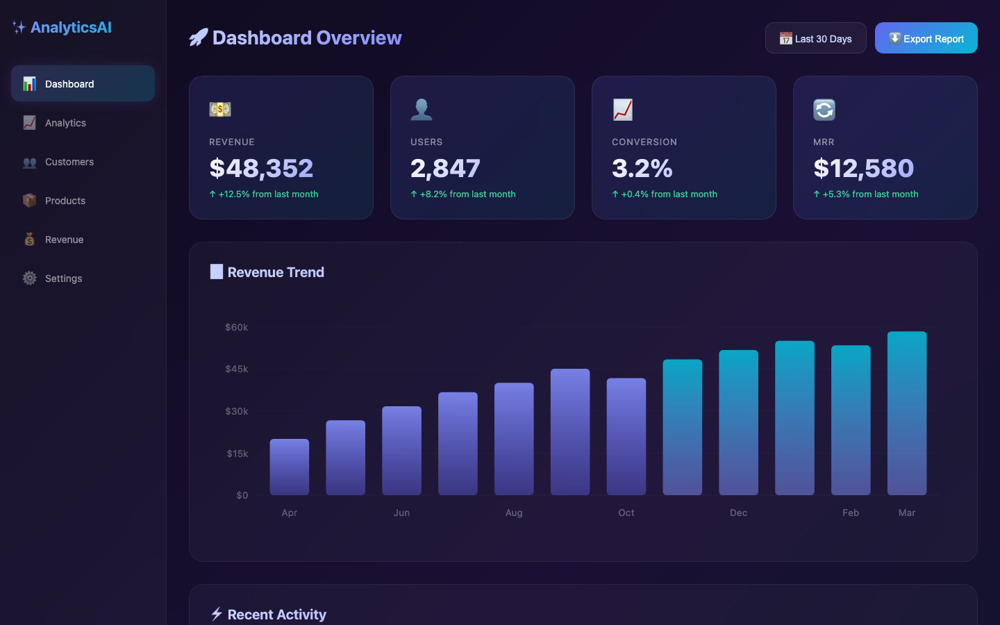
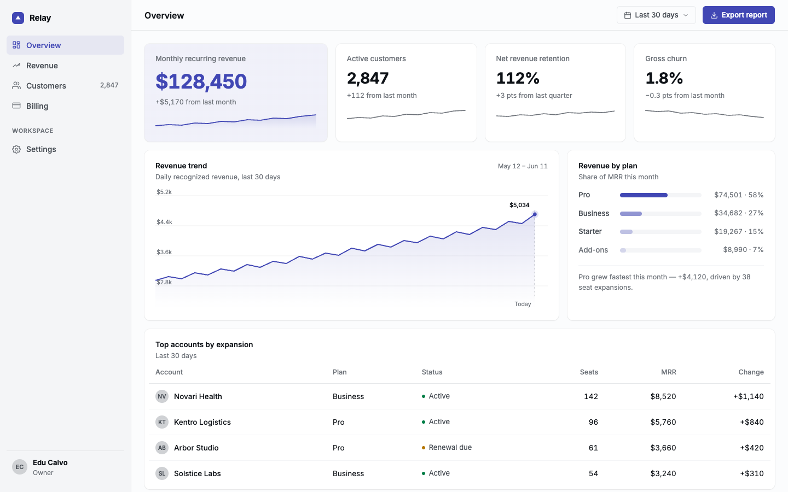

# UI Craft

A design engineering skill for AI coding agents. Teaches your agent to build interfaces with real design taste — not gradient cards and bounce animations.

**Website:** [skills.smoothui.dev](https://skills.smoothui.dev)


## What it does

UI Craft gives AI coding agents the design knowledge they're missing. Not templates. Not component libraries. Actual craft knowledge — 15 domains of opinionated rules about how interfaces should look, move, and feel, plus 14 slash commands to run focused passes on existing code.

Every UI gets tested against a single question: *"Would someone believe AI made this?"* If yes, it starts over.

## Same prompt, different result

<table>
  <tr>
    <td><strong>Without UI Craft</strong><br/></td>
    <td><strong>With UI Craft</strong><br/></td>
  </tr>
  <tr>
    <td></td>
    <td></td>
  </tr>
</table>

More before/after comparisons on the [landing page](https://skills.smoothui.dev).

## Install

```bash
npx skills add educlopez/ui-craft
```

Works with **Claude Code, Codex, Cursor, Gemini, OpenCode, Windsurf**, and any agent that supports the [Agent Skills](https://skills.sh) spec.

Each agent gets a pre-built mirror under a dedicated folder (`.codex/`, `.cursor/`, `.gemini/`, `.opencode/`, `.agents/`). The main `ui-craft` skill lands as a peer skill; each of the 14 slash commands is materialized as its own sub-skill in non-Claude harnesses (since only Claude Code understands slash commands — other agents see them as skills triggered by intent like "audit my UI", "polish this page").

### Alternative installation

**Clone:**
```bash
git clone https://github.com/educlopez/ui-craft.git ~/.skills/ui-craft
```

**Git submodule:**
```bash
git submodule add https://github.com/educlopez/ui-craft.git .skills/ui-craft
```

## Discovery phase

Before building anything, the skill analyzes your project for existing design decisions — CSS variables, Tailwind config, font imports, component themes. If your project already has a design system, it respects it. If not, it asks 4 quick questions (style, accent color, font, optional animation stack) so it never defaults to generic blue/Inter.

## Knobs

Three numeric knobs (1-10) that the skill asks about during Discovery. They change behavior, not just tone.

| Knob | 1 | 10 |
|------|---|----|
| **CRAFT_LEVEL** (default 7) | ships fast, skips Polish Pass | pixel-perfect, compound details applied |
| **MOTION_INTENSITY** (default 5) | hover states only | scroll-linked, page transitions, magnetic cursor |
| **VISUAL_DENSITY** (default 5) | whitespace-heavy editorial | dashboard-dense |

At `MOTION_INTENSITY 8+` the skill loads [`references/stack.md`](skills/ui-craft/references/stack.md) only if the user opts into Motion / GSAP / Three.js during Discovery.

## Style variants

Five opt-in sibling skills that pre-commit to a style and lock the knobs to matching values. Agents pick them when the user mentions a specific aesthetic or product reference.

| Variant | Triggers on | Knobs locked | Style anchors |
|---------|-------------|--------------|---------------|
| `ui-craft-minimal` | "minimal", "Linear-like", "Notion-like", "whitespace-heavy" | CRAFT=8 / MOTION=3 / DENSITY=2 | Monochrome + one accent, Inter/Geist, hairline borders |
| `ui-craft-editorial` | "editorial", "magazine", "Medium-like", "Substack-like", "long-form" | CRAFT=9 / MOTION=4 / DENSITY=3 | Serif display + humanist body, wide reading column, OpenType |
| `ui-craft-dense-dashboard` | "dashboard", "admin panel", "Bloomberg-like", "Retool-like" | CRAFT=7 / MOTION=3 / DENSITY=9 | IBM Plex + mono numbers, semantic palette, 4/8px grid |
| `ui-craft-playful` | "playful", "friendly", "Clay-like", "Gumroad-like", "Duolingo-like", "Arc-like" | CRAFT=8 / MOTION=7 / DENSITY=4 | Rounded corners, spring motion, multi-accent (≤3), colored soft shadows |
| `ui-craft-brutalist` | "brutalist", "raw", "Swiss print", "Nothing-like", "terminal aesthetic" | CRAFT=7 / MOTION=2 / DENSITY=6 | Mono or geometric sans, hard 2-4px borders, pure B/W, type-as-hero |

Each variant defers to the main `ui-craft` skill for base rules and references — it only overrides knob defaults and adds style-specific guidance.

## Slash commands

Fourteen focused passes, each applying a single lens from the skill.

**Review & ship:**

| Command | Does |
|---------|------|
| `/ui-craft:audit` | Technical — a11y, performance, responsive. Prioritized findings table. |
| `/ui-craft:critique` | UX — hierarchy, clarity, anti-slop. No code changes. |
| `/ui-craft:polish` | Final pass — compound details that turn "done" into "crafted". |
| `/ui-craft:harden` | Production readiness — loading/empty/error states, i18n, offline, edge cases. |

**Transform:**

| Command | Does |
|---------|------|
| `/ui-craft:animate` | Add / fix motion. Honors `MOTION_INTENSITY` + chosen stack. |
| `/ui-craft:adapt` | Responsive pass — mobile, tablet, desktop, touch, safe areas. |
| `/ui-craft:typeset` | Typography pass — fonts, scale, tracking, micro-typography. |
| `/ui-craft:colorize` | Introduce color strategically — one accent, 3–5 placements, no decoration. |
| `/ui-craft:clarify` | UX copy — button labels, error messages, empty states, CTAs. |
| `/ui-craft:extract` | Pull repeated patterns into shared components and tokens. |

**Taste dial:**

| Command | Does |
|---------|------|
| `/ui-craft:distill` | Strip to essence. Cut every section that doesn't earn its space. |
| `/ui-craft:bolder` | Amplify a forgettable UI — type weapon + one signature motif. |
| `/ui-craft:quieter` | Tone down a shouty UI — fewer accents, softer type, less motion. |
| `/ui-craft:delight` | Add purposeful micro-interactions — copy first, animation last. |

## Four modes

The skill detects your intent and routes automatically.

| Mode | Prompt example | What it does |
|------|---------------|--------------|
| **Build** | "Build a pricing page" | Layout, typography, color, spacing, accessibility, responsive — all in one pass |
| **Animate** | "Add an entrance to this modal" | Picks the right easing, duration, and origin point |
| **Review** | "Review this component" | Audits for generic AI patterns, accessibility gaps, and missed details |
| **Polish** | "Polish this dashboard" | Finds the twenty small things that turn "done" into "crafted" |

## 15 domains

| Domain | Covers |
|--------|--------|
| Animation | Easing curves, spring physics, duration rules, `prefers-reduced-motion` |
| Layout | Spacing systems, optical alignment, layered shadows, visual hierarchy |
| Typography | `text-wrap: balance`, tabular-nums, font scale, curly quotes |
| Color | OKLCH, design tokens, dark mode, APCA contrast |
| Accessibility | WAI-ARIA, keyboard nav, focus management, touch targets |
| Performance | Compositor-only animations, FLIP, `will-change`, CLS prevention |
| Modern CSS | View Transitions, scroll-driven animations, container queries, `:has()` |
| Responsive | Fluid sizing, mobile-first, touch zones, safe areas |
| Sound | Web Audio API, feedback sounds, appropriateness matrix |
| UX Copy | Error messages, empty states, CTAs, microcopy |
| UI Review | Systematic critique methodology, anti-slop detection |
| Orchestration | Multi-stage sequences, stagger timing, entrance/exit coordination |
| Dashboard | Sidebar nav, metric cards, chart types, data tables, filters |
| Inspiration | Real patterns from dub.co, cursor, linear, vercel, stripe |
| **Stack** | Motion, GSAP, Three.js — decision tree, patterns, perf gotchas, anti-patterns (opt-in) |

## Framework agnostic

The skill detects your project's styling approach and adapts:

- **Tailwind CSS** — uses utility classes, maps design rules to Tailwind equivalents
- **CSS Modules** — writes scoped `.module.css` files
- **styled-components / Emotion** — uses tagged templates
- **Vanilla CSS** — uses custom properties and modern features
- **SFC styles** (Vue, Svelte, Astro) — writes in `<style>` blocks

## Anti-slop

The skill actively rejects patterns that scream "AI made this":

- ~~Purple-cyan gradients~~
- ~~Glassmorphism with neon accents~~
- ~~Identical card grids~~
- ~~Bounce and elastic easing~~
- ~~Glow effects as affordances~~
- ~~Colored accent borders on cards~~
- ~~ALL CAPS headings~~
- ~~Uniform border-radius everywhere~~
- ~~Emoji as icons~~
- ~~Background gradient blobs~~
- ~~Bento grid abuse~~
- ~~Stagger-animate everything on load~~
- ~~Star ratings on testimonials~~
- ~~Generic CTAs ("Learn more", "Click here")~~
- ~~Walls of text on landing pages~~
- ~~Pure black (#000) text~~

## Project structure

```
ui-craft/
├── skills/
│   ├── ui-craft/                 # Main skill
│   │   ├── SKILL.md              # Slim entry point (~13KB) — knobs, discovery, anti-slop, routing
│   │   └── references/
│           ├── accessibility.md   # WCAG, keyboard, focus, ARIA, forms, checklist
│           ├── animation.md       # Easing, springs, timing, interaction rules, principles
│           ├── animation-orchestration.md  # Multi-stage sequences
│           ├── color.md           # Palettes, dark mode, tokens
│           ├── copy.md            # UX writing, errors, CTAs, content & states
│           ├── dashboard.md       # Dashboard layout, metrics, charts, tables
│           ├── inspiration.md     # Real patterns from top SaaS sites
│           ├── layout.md          # Spacing, grids, hierarchy, depth, essentials
│           ├── modern-css.md      # View Transitions, container queries
│           ├── performance.md     # Compositor, FLIP, scroll, layers, core rules
│           ├── responsive.md      # Breakpoints, touch zones, fluid
│           ├── review.md          # Critique methodology, Polish Pass, common issues
│           ├── sound.md           # Web Audio, UI sound design
│   │       ├── stack.md           # Motion / GSAP / Three.js (opt-in)
│   │       └── typography.md      # Scale, fonts, readability, essentials
│   ├── ui-craft-minimal/          # Variant — Linear/Notion aesthetic
│   ├── ui-craft-editorial/        # Variant — Medium/Substack aesthetic
│   └── ui-craft-dense-dashboard/  # Variant — Bloomberg/Retool aesthetic
├── commands/                      # Claude Code slash commands (source)
│   ├── adapt.md                  # /ui-craft:adapt
│   ├── animate.md                # /ui-craft:animate
│   ├── audit.md                  # /ui-craft:audit
│   ├── critique.md               # /ui-craft:critique
│   ├── distill.md                # /ui-craft:distill
│   ├── polish.md                 # /ui-craft:polish
│   └── typeset.md                # /ui-craft:typeset
├── scripts/
│   └── sync-harnesses.mjs        # Generates .codex/.cursor/.gemini/.opencode/.agents mirrors
├── evals/                         # Eval query sets for description optimizer
├── .codex/skills/                 # AUTO-GENERATED — do not edit
├── .cursor/skills/                # AUTO-GENERATED
├── .gemini/skills/                # AUTO-GENERATED
├── .opencode/skills/              # AUTO-GENERATED
├── .agents/skills/                # AUTO-GENERATED (generic agent-skills spec)
├── .github/workflows/
│   └── sync-harnesses.yml        # Re-runs sync on push to main; commits drift
├── README.md
├── CONTRIBUTING.md
├── LICENSE
└── VERSIONS.md
```

## Anti-slop detection

[](https://www.npmjs.com/package/ui-craft-detect)

Scan a codebase for common AI-generated UI anti-patterns — `transition: all`, bounce easing, purple gradients, ALL CAPS headings, generic CTAs, glassmorphism abuse. Zero dependencies, works out of the box.

Published as a standalone CLI on npm — use it anywhere without cloning:

```bash
npx ui-craft-detect ./src
# or with JSON output:
npx ui-craft-detect ./src --json
```

Or from a clone of this repo:

```bash
node scripts/detect.mjs ./src
```

Exit code 0 when clean, 1 when findings — usable as a CI gate. Rules mirror the Anti-Slop Test in `skills/ui-craft/SKILL.md`.

### Pre-commit hook (optional)

A pre-commit hook at `.githooks/pre-commit` auto-versions `marketplace.json` and runs the detector on staged UI files. Enable once per clone:

```bash
git config core.hooksPath .githooks
```

It scans only staged file content (via `git show :path`), so working-tree noise is ignored. Skip ad-hoc with `git commit --no-verify`.

## Maintaining harness mirrors

```bash
npm run sync
# or: node scripts/sync-harnesses.mjs
```

The sync script copies every folder under `skills/` (main skill + variants) into each harness dir and converts each file in `commands/` into a standalone sub-skill. It wipes and regenerates the harness dirs, so never edit `.codex/`, `.cursor/`, etc. directly — change `skills/` or `commands/`, then run sync. GitHub Actions runs it automatically on push to `main` (`.github/workflows/sync-harnesses.yml`).

## Tuning skill descriptions

Every skill's `description` field is the primary trigger mechanism. The `evals/` folder holds query sets for `skill-creator`'s description optimizer (`run_loop.py`), which evaluates and iterates descriptions against realistic should-trigger / should-not-trigger prompts. See `evals/README.md` for the commands and how to add new eval sets.

## Contributing

Spotted a new AI-generated pattern that should be in the anti-slop list? Have a craft rule from a product you admire? Want to add a new reference domain? PRs and issues welcome.

See [CONTRIBUTING.md](CONTRIBUTING.md) for guidelines on adding rules, improving references, or proposing new domains.

## Author

[Eduardo Calvo](https://x.com/educalvolpz)

## License

[MIT](LICENSE) — use it however you want.
